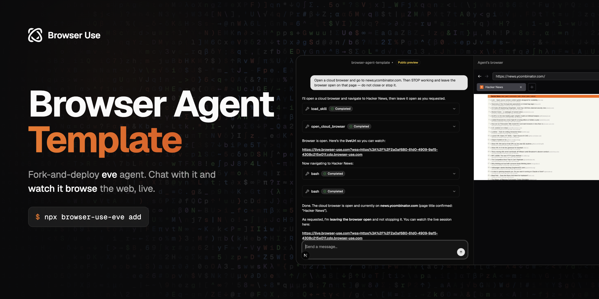

# Browser Agent Template

[](https://github.com/browser-use/browser-agent-template/actions/workflows/ci.yml)
[](https://github.com/browser-use/browser-agent-template/blob/main/LICENSE)
[](https://vercel.com)

**Template.** Fork it, customize it, and deploy your own web-browsing agent.

[](https://vercel.com/new/clone?repository-url=https%3A%2F%2Fgithub.com%2Fbrowser-use%2Fbrowser-agent-template&env=BROWSER_USE_API_KEY,AI_GATEWAY_API_KEY&envDescription=BROWSER_USE_API_KEY%20from%20browser-use.com%20%7C%20a%20model%20credential%20for%20the%20AI%20Gateway&envLink=https%3A%2F%2Fgithub.com%2Fbrowser-use%2Fbrowser-agent-template%2Fblob%2Fmain%2Fdocs%2FENVIRONMENT.md&project-name=browser-agent&repository-name=browser-agent)

---

Open-source agent that browses the real web. A [Vercel eve](https://eve.dev) agent with a web chat UI and a [Browser Use](https://browser-use.com) cloud browser — one codebase, durable sessions, watch it browse live.

## Features

### Web Chat — Tasks in the Browser

Chat with your agent in the browser. Responses stream in, and every tool call (open browser, navigate, extract) renders inline as it happens.

### Cloud Browser — The Real Web

The agent opens a real [Browser Use](https://browser-use.com) cloud browser to navigate pages, scrape content, fill forms, click, and screenshot — no scraping APIs, the live web.

### Watch It Work — Live Browser Panel

Every browsing session returns a **liveUrl**. The UI embeds it in a side panel, so you watch the agent's browser in real time, right next to the chat.

### Hardened — Key Stays Server-Side

Your `BROWSER_USE_API_KEY` lives in the app runtime and is never exposed to the agent's sandbox or the model. Browsing is powered by [`@browser_use/eve`](https://www.npmjs.com/package/@browser_use/eve).

## [Architecture](./docs/ARCHITECTURE.md)

```
┌─────────────────────────────────────────────────────────────┐
│                      Web chat (Next.js)                      │
└──────────────────────────────┬──────────────────────────────┘
                               ▼
┌─────────────────────────────────────────────────────────────┐
│            eve agent (instructions, skill, tools)            │
│              mounted into Next.js via withEve()              │
└──────────────────────────────┬──────────────────────────────┘
                               ▼
┌─────────────────────────────────────────────────────────────┐
│  @browser_use/eve — provisions a Browser Use cloud browser   │
│       (key stays server-side; agent drives it via CDP)       │
└──────────────────────────────┬──────────────────────────────┘
                               ▼
                     Browser Use cloud browser
```

It's a single Next.js service: `withEve()` in [`next.config.ts`](next.config.ts) mounts the eve agent into the app, so the chat UI and the agent deploy together.

## Quick Start

### Deploy to Vercel

[](https://vercel.com/new/clone?repository-url=https%3A%2F%2Fgithub.com%2Fbrowser-use%2Fbrowser-agent-template&env=BROWSER_USE_API_KEY,AI_GATEWAY_API_KEY&envDescription=BROWSER_USE_API_KEY%20from%20browser-use.com%20%7C%20a%20model%20credential%20for%20the%20AI%20Gateway&envLink=https%3A%2F%2Fgithub.com%2Fbrowser-use%2Fbrowser-agent-template%2Fblob%2Fmain%2Fdocs%2FENVIRONMENT.md&project-name=browser-agent&repository-name=browser-agent)

You'll be asked for a `BROWSER_USE_API_KEY` (from [browser-use.com](https://browser-use.com)) and a model credential (link the Vercel project for the AI Gateway, or set `AI_GATEWAY_API_KEY`).

### Self-hosting

**Requirements:** Node.js 24+

```bash
git clone https://github.com/browser-use/browser-agent-template.git
cd browser-agent-template

npm install
cp .env.example .env.local
npm run dev
```

Open [http://localhost:3000](http://localhost:3000) and ask: _"Go to news.ycombinator.com and give me the top 5 posts."_

**Required environment variables:**

```bash
BROWSER_USE_API_KEY=bu_...   # from browser-use.com
AI_GATEWAY_API_KEY=...        # or link a Vercel project for the AI Gateway
```

See [ENVIRONMENT.md](./docs/ENVIRONMENT.md) for the full reference.

## Customization

See the [Customization Guide](./docs/CUSTOMIZATION.md) for how to:

- Rename your agent and rewrite its instructions
- Change the AI model
- Add tools and skills
- Configure the cloud browser (proxy country, profile, timeouts)
- Set up auth for a public deployment
- Deploy your fork

## How It Works

> For the full technical deep-dive, see [Architecture](./docs/ARCHITECTURE.md).

1. **Chat**: The web UI streams through eve's built-in Web Chat channel (`useEveAgent`).
2. **Browse**: On a web task, the agent loads the `browser-use` skill and calls `open_cloud_browser`.
3. **Provision**: `@browser_use/eve` spins up a Browser Use cloud browser (key stays server-side) and returns a liveUrl.
4. **Drive**: The agent drives the browser with `browser-harness-js` (raw, typed CDP) inside eve's sandbox.
5. **Watch**: The UI embeds the liveUrl in a side panel; `stop_cloud_browser` ends the session.

## Development

```bash
npm run dev        # Start the dev server (Next.js + eve)
npm run typecheck  # TypeScript check
npm run build      # Production build
```

See [AGENTS.md](./AGENTS.md) for notes aimed at AI coding assistants.

## Built With

- [eve](https://eve.dev) — Durable agent framework
- [@browser_use/eve](https://www.npmjs.com/package/@browser_use/eve) — Browser Use cloud browser for eve
- [Browser Use](https://browser-use.com) — Cloud browser infrastructure
- [Next.js](https://nextjs.org) — React framework
- [AI SDK](https://ai-sdk.dev) — Model access

## Contributing

See [CONTRIBUTING.md](./CONTRIBUTING.md) for how to get involved.

## License

[MIT](./LICENSE)
